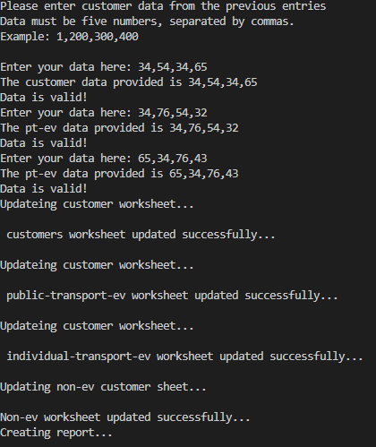
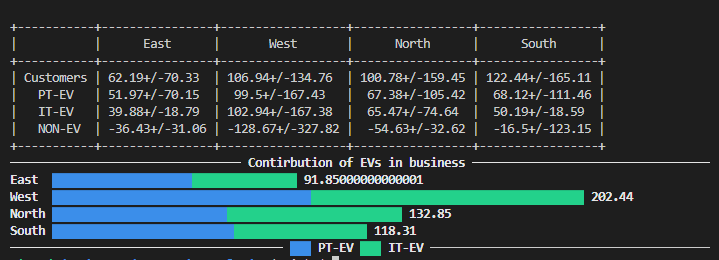

## Gas Station Analysis project

This project is created by considering following assumptions.
The company has several gaas stations through out the country
The data consists the information of number of customers each day.
Gathered data are of North, East, West and South stations.
Customers are coming to charge their Electric vehicles(EVs) and for other purchase such as small store in gas station or car wash.

Data is gathered in google sheet, in which different worksheet includes number of public transport EVs, individual transportation EVs, and non-EV(others).

Here, backend command line app is developed, in which the user can add data in different sheets, and other sheets are updated using google cloud platform. And this app is deployed using Heroku.

This app also created one small report mentioning average customers of different class for different regions with uncertainty quantification. And at the end it also create one small bar plot of the data.

